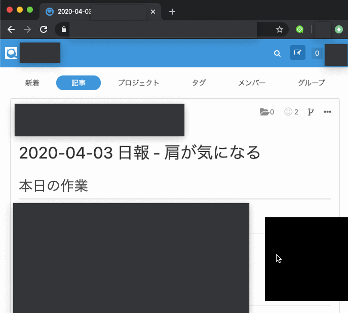
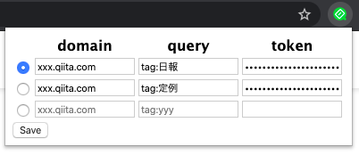
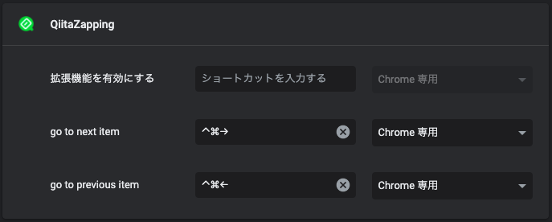

# QiitaZapping

## 概要

検索設定に該当する記事のザッピング(関連する記事の遷移) 支援

QiitaZapping を用いて会社の日報を読んでいる様子

## 仕組み

- Qiita API から `検索設定` の最新記事 100 件を取得
- 現在開いている記事の前後の作成日時の記事を判定
    - 読み込み高速化のため前後記事は `prefetch` 指定
- ショートカットに従って遷移

## 利用の流れ

1. ブラウザ右上の extension アイコンから検索設定を記入
1. ショートカットの設定
1. 設定したショートカットでページ遷移

### 1. ブラウザ右上の extension アイコンから検索設定を記入

以下を記入。

- domain
    - `query` を適用するドメインを指定
    - `qiita.com` or `xxx.qiita.com`
- query
    - ザッピングを行う検索条件を指定
    - 例: tag:日報
- token
    - 発行方法: qiita のプロフィールアイコンから `設定` -> `アプリケーション` -> `個人用アクセストークン`
    - スコープ: `reqd_qiita` or `read_qiita_team`

最後に有効化するラジオボタンを選択して `Save` を押下。

### 2. ショートカットの設定

- `chrome://extensions/shortcuts` にアクセス
- QiitaZapping の `go to next item`, `go to previous item` にお好みのショートカットを設定

### 3. 設定したショートカットでページ遷移

`go to next item`, `go to previous item` に設定したショートカットでザッピング開始

## 制限

- `query` 指定の最新 100 件の記事に対してのみ有効
- 検索設定は3件のみ
